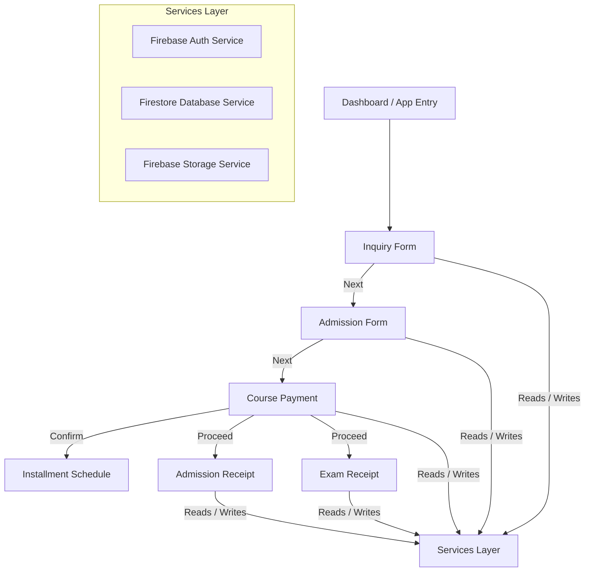

# Recreating App Script Workflow with Firebase

Recreate the complete multi-step workflow from the current Apps Script project into a standalone web application powered by Firebase (Firestore, Storage, and Authentication). The project must maintain the exact UI flow, validation logic, responsive layouts, data construction priorities, and user experience.

## User Review Required

> [!IMPORTANT]
> **Architecture Selection: Vanilla HTML/JS (Recommended) vs. React/Vite**
> - **Vanilla HTML/JS (Recommended)**: We can preserve the existing HTML files (`index.html`, `SideBar.html`, `CoursePayment.html`, etc.) and CSS with minimal modifications, simply replacing `google.script.run` with Firebase SDK calls. This guarantees 100% identical styling, CSS animations, and UI behavior.
> - **React/Vite**: Requires rewriting all the existing markup, tables, and scripts into React components. It offers better state management but has a higher risk of slight UI/CSS variations.
>
> **Our recommendation is to proceed with Vanilla HTML/JS** using ES Modules and Firebase CDN SDK v10+, as it keeps the visual identity perfectly intact.

> [!WARNING]
> **Firebase Credentials & Setup**
> - You will need to create a Firebase project in the Firebase Console.
> - Enable **Email/Password Authentication**.
> - Create a **Cloud Firestore** database in test mode or with proper security rules.
> - Enable **Cloud Storage** for student photo uploads.
> - Provide the Firebase Configuration object (API key, Auth Domain, Project ID, Storage Bucket, etc.) to configure the app.

> [!NOTE]
> **Workspace Organization**
> - We propose creating an `appscript-backup/` folder to store all current `.js` and `.html` files for safety.
> - The new Firebase-based web application will be developed directly at the root (`index.html`, `src/` folder for JS modules, `css/` for styles).

## Open Questions

> [!IMPORTANT]
> 1. **Do you already have a Firebase project created, or would you like me to guide you through creating one?**
> 2. **Are there any other custom fields or additional validation checks required during the migration?**
> 3. **Should the data fields remain strictly matching the existing schema, or should we clean up naming conventions (e.g. CamelCase instead of visual column labels)?** We recommend mapping sheet columns directly to Firestore fields to maintain consistency.

---

## Proposed Changes

### Database & Storage Mapping

We will map the existing Google Sheets to Firestore Collections as follows:

| Google Sheet Name | Firestore Collection | Key Document Fields |
| :--- | :--- | :--- |
| `Inquiries` | `inquiries` | `aadhaar`, `fullName`, `phone`, `email`, `address`, `interestedCourse`, `admissionStatus`, `timestamp`, `branch` |
| `STUDENT DATA` | `students` | `studentId` (ST001...), `studentName`, `fatherName`, `trade`, `totalFees`, `session`, `branch` |
| `FEES` | `fees` | `studentId`, `date`, `month`, `transactionId`, `paidAmount`, `paidAmountInWord`, `feesType`, `paymentMode`, `userName` |
| `LOGIN` | `users` | `email` (auth mapping), `role`, `branch`, `userName` |
| `InstallmentSchedules`| `installmentSchedules` | `enrollmentId`, `studentName`, `paymentType`, `totalFee`, `installments` (array of objects with `number`, `dueDate`, `amount`, `status`) |
| `InstallmentPayments` | `installmentPayments` | `enrollmentId`, `studentName`, `installmentNumber`, `amountPaid`, `paymentMethod`, `paymentDate`, `loggedInUser` |
| `RECEIPT` (Exam) | `examReceipts` | `receiptNo`, `receiptDate`, `studentName`, `courseName`, `totalAmount`, `paymentMode`, `agreeTerms` |
| `FeeStructure` | `feeStructures` | `enrollmentId`, `studentName`, `courseName`, `courseFee`, `courseFeeDue`, `admissionFee`, `admissionFeeDue`, `examFee`, `examFeeDue` |
| `DROPDOWN` | `dropdowns` | Dynamic options for `sessions`, `trades`, `feesTypes`, `paymentModes` |

**Storage:**
- Student photos (currently uploaded to Google Drive folder `ADMISSIONS_PDF_FOLDER_ID`) will be uploaded to Firebase Cloud Storage under `student_photos/{enrollmentId}.jpg`.

---

### Component Architecture

---

### File Modifications

We will organize the code using clean vanilla ES Modules:

#### [NEW] [firebase-config.js](file:///c:/Users/phita/project10/AppscriptProject/src/firebase-config.js)
Stores Firebase configuration initialization. It will read keys from a configuration object or environment setup.

#### [NEW] [db-service.js](file:///c:/Users/phita/project10/AppscriptProject/src/db-service.js)
Abstracts all Firestore CRUD operations (e.g. `submitInquiry`, `loadStudentData`, `saveInstallmentSchedule`, `saveInstallmentPayment`) replacing the old Apps Script functions in `Code.js`.

#### [NEW] [auth-service.js](file:///c:/Users/phita/project10/AppscriptProject/src/auth-service.js)
Handles user login, logout, and state persistence using Firebase Authentication, retrieving roles and branch access from the `users` collection.

#### [MODIFY] [index.html](file:///c:/Users/phita/project10/AppscriptProject/index.html)
- Main application file.
- Replaces backend Apps Script script includes (`<?!= include('SideBar'); ?>`) with local HTML file inclusion or direct DOM insertion.
- Adds Firebase Client SDK libraries.
- Integrates the Sign-in workflow using Firebase Auth.

#### [MODIFY] [script.html](file:///c:/Users/phita/project10/AppscriptProject/script.html) → `src/main.js`
- Move all client-side JS into external ES Module file `src/main.js`.
- Replace `google.script.run` async calls with calls to `db-service.js` and `auth-service.js`.

---

## Verification Plan

### Automated Tests
- Since this is a vanilla frontend app, we will use standard linting and formatting.
- Verification script `src/test-firebase.js` to run a simulation of auth and firestore operations against Firebase emulator or staging project.

### Manual Verification
1. **Login Flow**: Verify users are correctly authenticated via Firebase Auth, and dashboard loads corresponding role/branch views.
2. **Inquiry -> Admission Flow**: Submit inquiry, search by Aadhaar, prefill admission form, verify session data transfer.
3. **Course Payment & Installments**: Lock a payment option (Full/Partial/EMI), check that table rows are generated correctly, confirm individual installment checkmarks, verify Firebase updates.
4. **Receipt Generation & PDF**: Click print buttons, check PDF styling and auto-generated data rendering.
